# *About* ❓
**This is Bookshop system..**.

# *Admin Login*
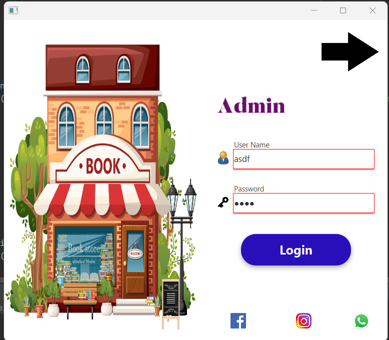

# *Item*
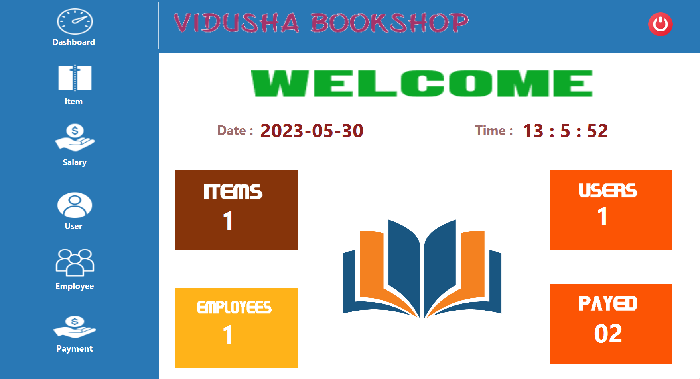

# *Item*
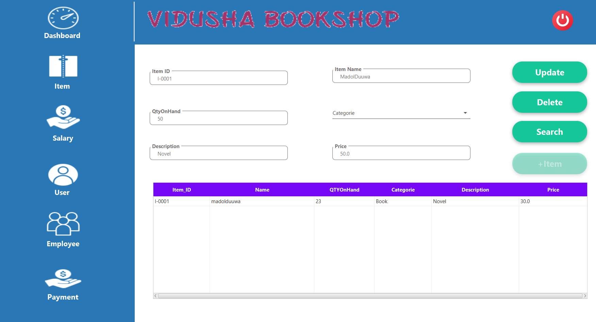

# *User*
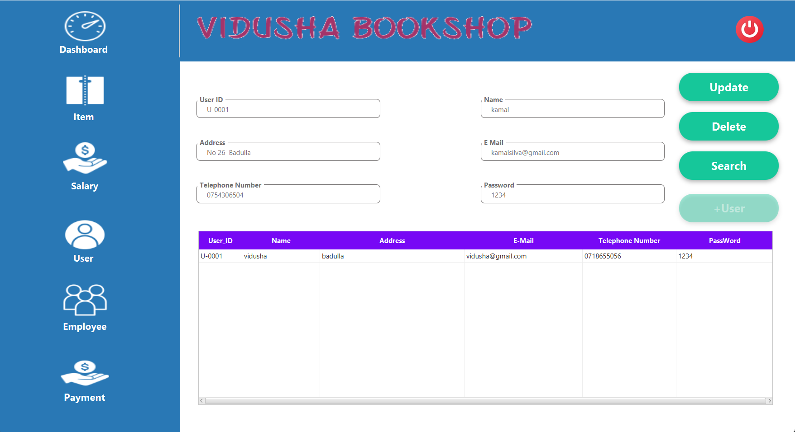

# *Salary*
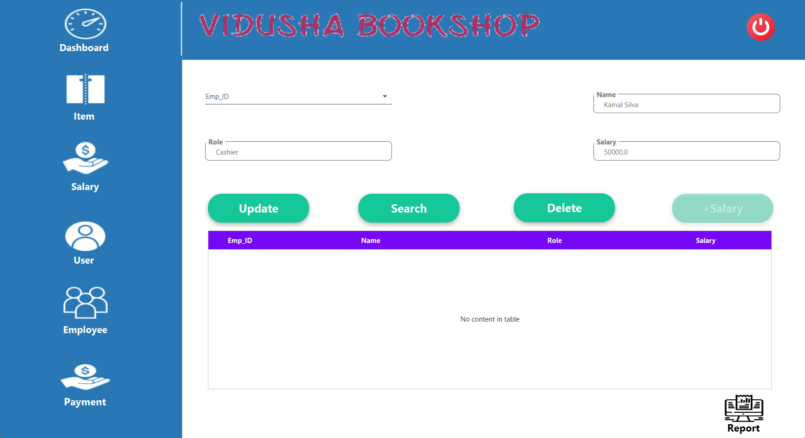

# *Employee*
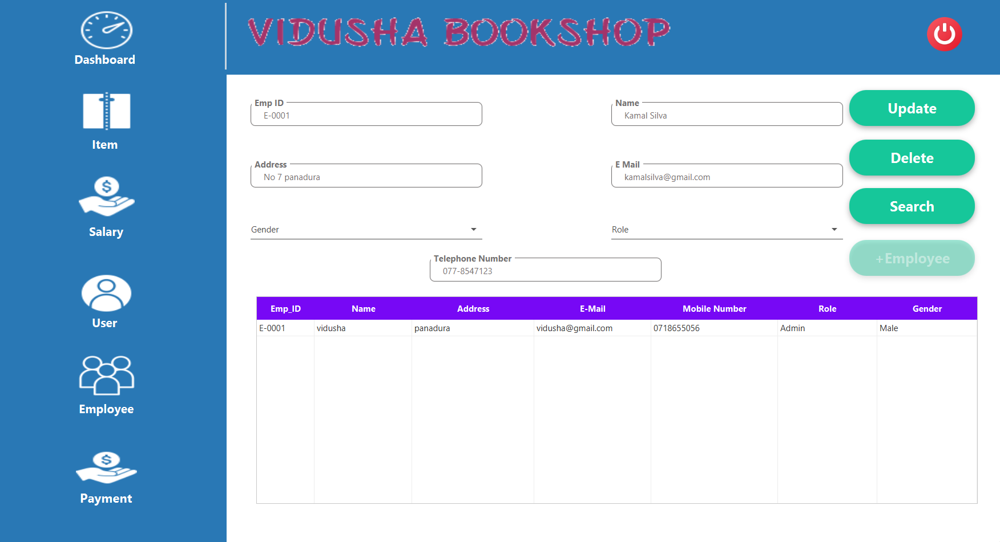

# *Payment*
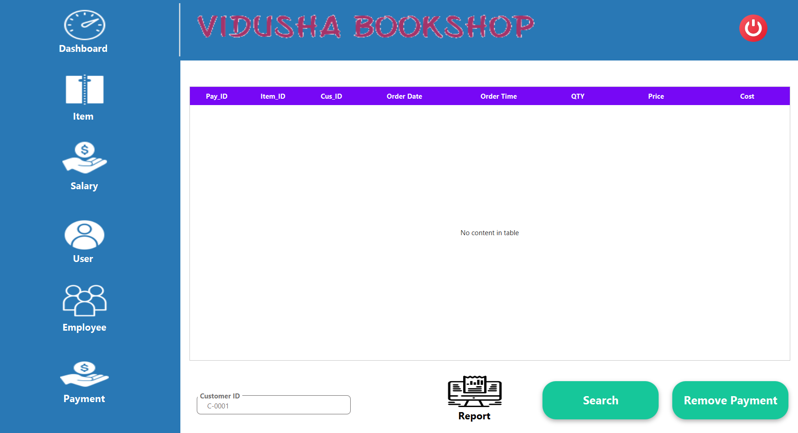

# *Cashier Login*
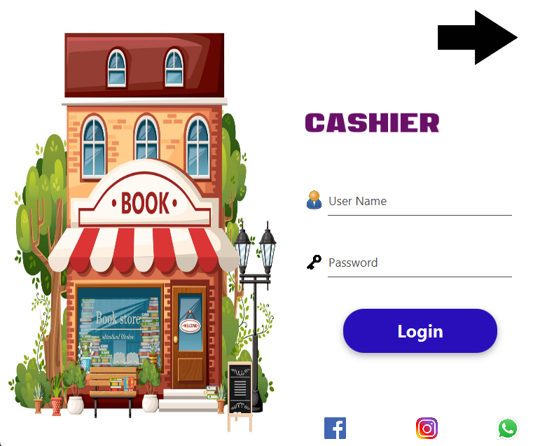

# *Item*
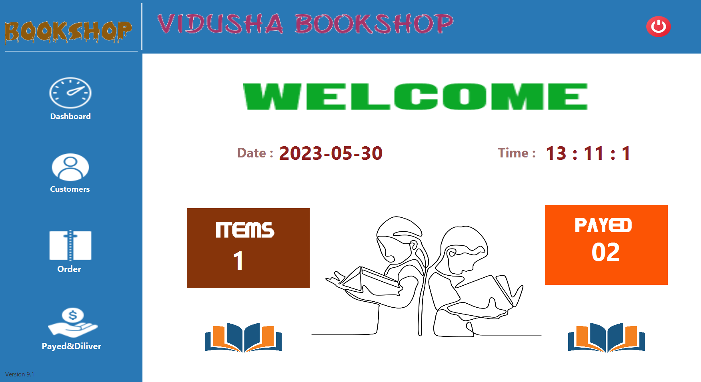

# *Customer*
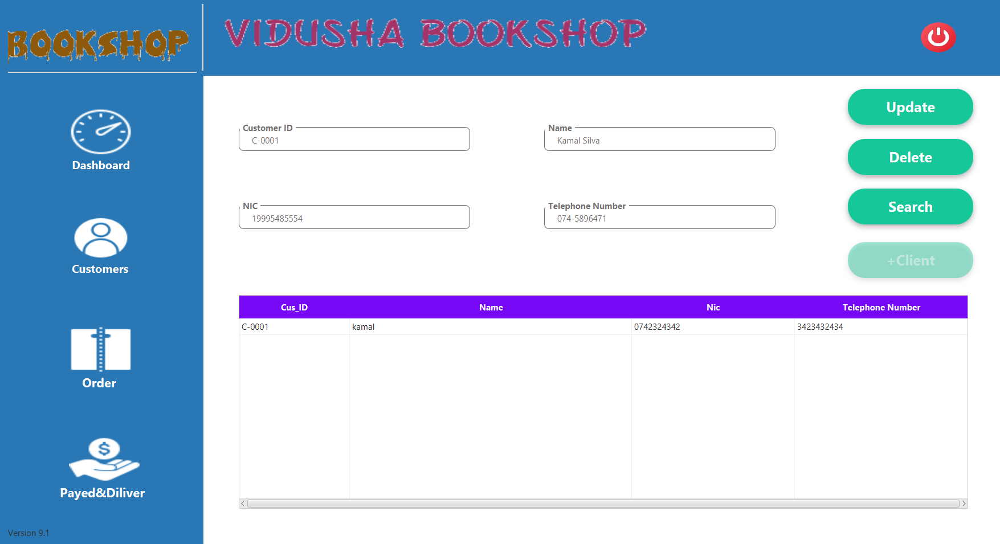

# *Order*
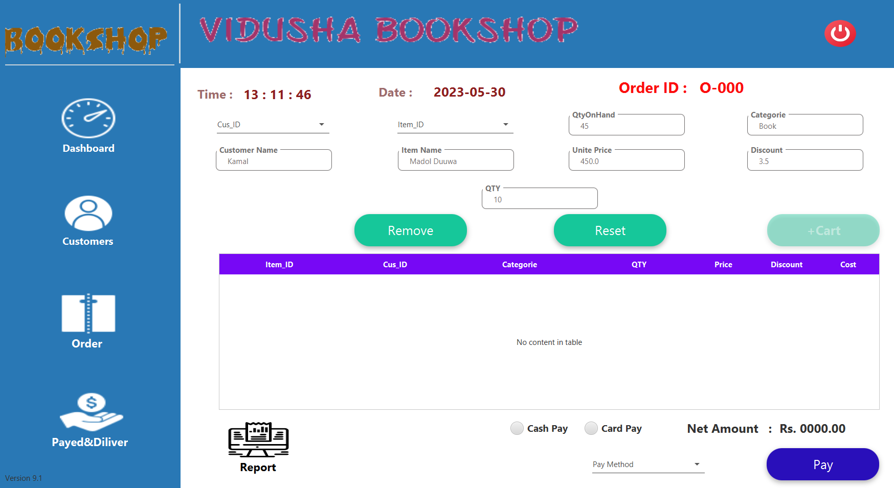

# *Payment & Deliver*
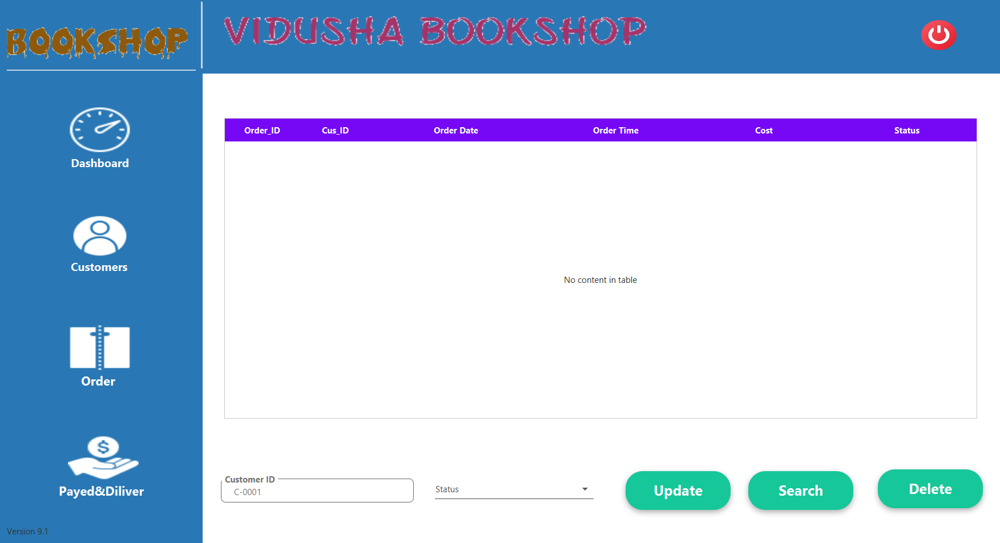